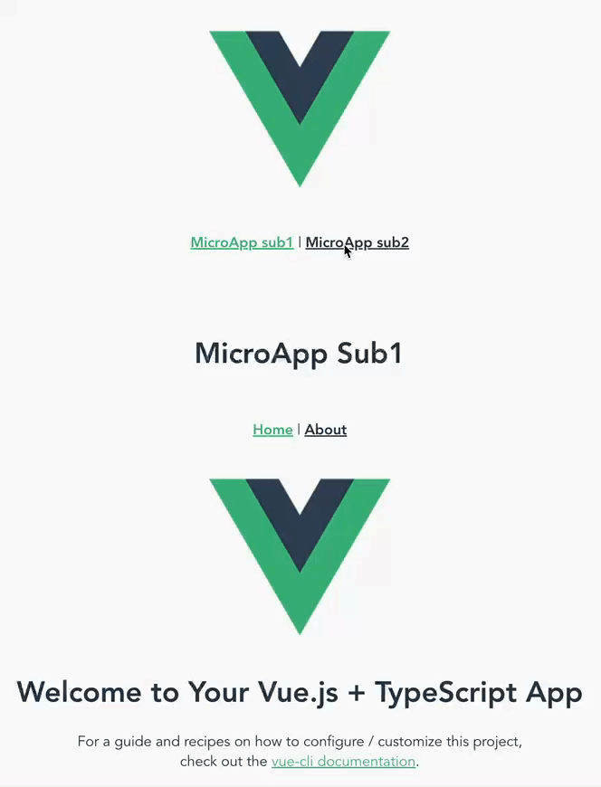

## qiankun 微前端框架搭建测试

### 效果

### 结构

- microapp-main 主应用
- microapp-sub1 子应用 1
- microapp-sub2 子应用 2

想模拟的场景是:
老项目使用了 vue2 和 js 技术栈,然后新的模块想要采用 vue3+ts 编写

### 实现

- 主应用使用了 vue-cli 的默认 vue2.x 配置
  进行创建
- 子应用使用了 vue-cli 的默认 vue3.x + TypeScript + ESlint + Prettier 配置创建

### 启动方式

1. 启动子应用
2. 启动父应用
3. 支持单独访问子应用 和 在父应用中切换子应用

### 踩坑

主项目采用 vue2, 子项目采用 vue3, 在 qiankun 的文档中并没有介绍如何使用 vue3, 在参考了一些博客后, 搭出了原型, 但是发现来回切换两个子应用会报错

> `TypeError: application 'microapp-sub1' died in status NOT_MOUNTED: Cannot redefine property: $route`

官方文档也有这个问题的解决方法,改动主应用,不过试了试对子应用为 Vue3 的版本似乎不奏效.

最终是在子应用的 main.ts 暴露的卸载方法中,调用 app.unmount 以后再手动把 app 赋值为 null,最终解决了该报错

### 说明

搭建微应用项目远不止这么简单,目前只是稍作尝试并记录,引入业务逻辑和各种框架后还需要考虑各种问题,还有待继续探究.
